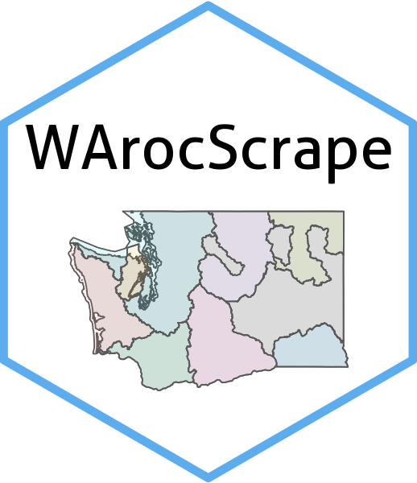

# WArocScrape 

## WArocScrape: Tools for Accessing and Working with the WA RCO Management Areas

This package is a growing set of tools for simplifying access to WA ROC shapefiles for Lead Entities and Salmon Recover Regions. 

Find more information about Lead Entities at Washington State's Recreation and Conservation Office's website:

https://rco.wa.gov/salmon-recovery/managing-organizations/lead-entities/#:~:text=Lead%20entities%20prioritize%20projects%20to,sustaining%20healthy%20populations%20of%20salmon.

Additionally, find more information about Salmon Recovery Regions at Washington State's Recreation and Conservation Office's website:

https://rco.wa.gov/salmon-recovery/managing-organizations/regions/


### Installation:

``` r
install.packages("remotes")
remotes::install_github("connorlewissmith/WArocScrape")
```

### Use:

load_lead_entities()

This function reads lead entities data from an ESRI REST API as a simple features object and
saves it to the working directory as an ESRI shapefile if the download_files argument is set to TRUE.

``` r
lead_entities <- load_lead_entities()
head(lead_entities)

lead_entities_file <- load_lead_entities(download_files = TRUE)
```

load_salmon_recovery_regions()

This function loads the salmon recovery regions data from the ESRI Open Data Portal and returns it as a sf object.
The user can also choose to save the data as an ESRI Shapefile by setting the download_files argument to TRUE.

``` r
salmon_recovery_regions <- load_salmon_recovery_regions()
head(salmon_recovery_regions)

salmon_recovery_regions <- load_salmon_recovery_regions(download_files = TRUE)
```
